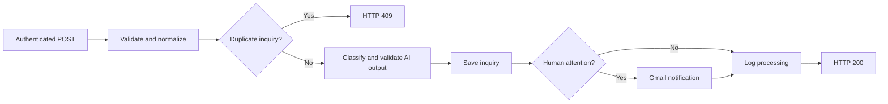

# AI-Powered Customer Inquiry Triage Automation

Portfolio Project #1 · n8n · OpenAI · Google Sheets · Gmail

## Overview

An end-to-end AI-assisted customer inquiry workflow built with n8n. It combines language-model classification with explicit validation, storage, routing, and response rules. This is an automation workflow, not an autonomous AI agent; people remain responsible for reviewing and resolving inquiries.

Incoming inquiries are:

1. Authenticated through a header-protected POST webhook.
2. Validated for required fields, types, formats, and length limits.
3. Normalized by trimming text and lowercasing email addresses.
4. Checked against previously stored inquiry IDs.
5. Classified using OpenAI structured output.
6. Stored in Google Sheets after AI-output validation.
7. Routed for human attention when required.
8. Optionally sent as internal Gmail notifications.
9. Logged with their notification outcome.
10. Returned with the appropriate HTTP response for the handled branch.

**Release note:** The public export is preserved exactly as supplied. Packaging review identified a response-expression issue in the storage-failure branch. Resolve it and rerun R11 before relying on the advertised 503 behavior. See [test results](docs/test-results.md#release-verification-issue). Live integrations were not rerun during packaging.

## Business Problem

Businesses receive questions, complaints, and opportunities through fragmented channels. Manually classifying, prioritizing, recording, routing, and following up on each message creates repetitive work and makes outcomes depend on who handles the inbox.

Common problems include inconsistent prioritization, missed urgent inquiries, duplicate submissions, limited reporting visibility, and a lack of structured review tracking. This project demonstrates a single webhook intake that could sit behind those channels; multi-channel connectors are future work.

## Solution

The workflow turns an inquiry into a structured record containing its original details, an AI-generated summary, classification, recommended action, and review status. Deterministic n8n branches reject invalid or duplicate requests and decide whether to request human attention. Google Sheets provides inspectable demonstration storage, while the workflow log records notification outcomes.

## Key Features

- Authenticated webhook intake, request validation, and normalization.
- Lookup-based duplicate detection before classification and storage.
- OpenAI structured classification with controlled categories, priority, sentiment, a summary, a recommended action, and a human-review flag.
- AI-output validation before downstream use.
- Google Sheets persistence with `Review Status` tracking.
- Gmail escalation for high-priority or human-review inquiries.
- Notification failure handling that preserves an already-saved inquiry.
- Storage failure routing and configured HTTP 200 / 400 / 409 / 500 / 503 response nodes, subject to the release note above.
- Compatibility with a separately configured centralized error-handler workflow.
- Spreadsheet RAW writes on `Save Inquiry` for formula-safety at the inquiry-storage boundary.

## Technology Stack

| Technology | Role |
| --- | --- |
| n8n | Workflow orchestration, validation, routing, and error outputs |
| OpenAI | Structured inquiry classification using `gpt-4o-mini` |
| Google Sheets | Demonstration data storage and workflow logging |
| Gmail | Internal attention notifications |
| HTTP Webhook | External request entry point and REST-style responses |
| Postman | API and regression testing in the author-reported test process |

Google Sheets is used for a small-scale demonstration, not as a production transactional database.

## Architecture



This is an overview of the accepted-request path. [Architecture](docs/architecture.md) shows the complete node routing, error branches, and optional error handler.

## Workflow Logic

Invalid requests exit before classification. Valid requests are normalized, then looked up by `Inquiry ID`. An existing row produces a duplicate response; a new ID proceeds to OpenAI. The workflow extracts the classification, combines it with the original inquiry, and validates it before writing a row.

After storage, high priority or a human-review flag triggers Gmail. The sent, failed, and not-required notification branches converge before logging and returning success. `Review Status` is an initial queue marker; the workflow does not assign a reviewer or update the record after a human resolves it.

## OpenAI Classification

The classifier returns six fields:

| Field | Meaning / allowed values |
| --- | --- |
| `summary` | Concise factual summary |
| `category` | `sales`, `support`, `billing`, `partnership`, `other` |
| `priority` | `high`, `medium`, `low` |
| `sentiment` | `positive`, `neutral`, `negative` |
| `recommended_action` | Suggested next step for a person or team |
| `needs_human_review` | Boolean indicating that human judgment is needed |

The request uses a strict JSON Schema with required fields and no additional properties. The downstream validator checks field presence, nonempty text, allowed labels, and the Boolean review flag before use. It does not independently reimplement every JSON Schema constraint.

The prompt treats inquiry text as data and separates priority from sentiment and human review. A negative message need not be urgent; an ambiguous low-priority message may still need a person. Only subject and message are explicitly sent to the classifier, although their text can itself contain personal information.

## Example Request

Send one JSON object per POST request. All examples are synthetic.

```json
{
  "inquiry_id": "SAMPLE-001",
  "submitted_at": "2026-10-02T01:00:00Z",
  "name": "Alex Example",
  "email": "alex@example.com",
  "subject": "Quotation for a small-team subscription",
  "message": "Could you provide pricing and onboarding options for a team of five? We are comparing services for next month."
}
```

## Example Successful Response

An illustrative response; exact model classifications can vary.

```json
{
  "success": true,
  "inquiry_id": "SAMPLE-001",
  "status": "processed",
  "category": "sales",
  "priority": "medium",
  "sentiment": "neutral",
  "human_review": false,
  "notification_status": "not_required"
}
```

## HTTP Responses

| Code | Handled condition |
| --- | --- |
| 200 | Inquiry processed and completion log written; notification may be sent, failed, or not required |
| 400 | Invalid inquiry payload |
| 409 | Existing inquiry ID; no new inquiry row is appended on this branch |
| 500 | Invalid or unusable classification output reaches the validation-failure branch |
| 503 | Intended response for a `Save Inquiry` failure; current export requires the expression correction described in the release note |

Authentication rejection happens at the webhook before these normal branches. OpenAI API failures, lookup failures, and log failures are not all mapped to these custom response bodies.

## Human Review Routing

Attention is required when `priority` is `high` **or** `needs_human_review` is `true`. Gmail is an internal alert, not an automated reply to the customer.

The stored `Review Status` is `Pending Review` when the review flag is true and `Not Required` otherwise. This field is based on the flag alone. The prompt asks for high-priority cases to also require review, but that relationship is not independently enforced by the downstream validator. See [limitations](docs/limitations.md).

## Security

The public template has no credential objects, private service links, deployment IDs, or real customer examples. Importers configure their own n8n credentials. Header authentication stays enabled, and the workflow imports inactive.

Input checks, constrained AI output, and RAW inquiry writes provide separate safeguards. Read [security controls and their boundaries](docs/security.md) before using real inquiry data.

## Error Handling

Gmail errors are captured as `notification_status = failed` after the inquiry has been stored. Provided the completion log succeeds, processing can still return HTTP 200. The failure message is recorded internally for investigation.

Storage failures are routed toward a 503 response and then `Stop and Error`; the packaged response-expression issue must be corrected to validate that behavior. Unexpected failures can invoke a separate n8n Error Trigger workflow once it is configured in Workflow Settings. That optional workflow is not included here.

## Testing

The project author reports completing a 12-case regression suite using synthetic data, with all cases passing in the tested environment. [Test results](docs/test-results.md) records that supplied report separately from packaging checks and the current-export R11 discrepancy. A Postman collection and execution screenshots are not included.

## Setup

Follow [setup instructions](docs/setup.md) to import the template, configure credentials, create the two sheet tabs, and test before activation.

## Screenshots

Add redacted images under `screenshots/` using the [capture guide](screenshots/README.md). No screenshots are bundled yet, and there are no placeholder image links.

## Limitations

Classification is probabilistic, Sheets duplicate lookup and append are not atomic, and integrations can fail. Rate limiting, reviewer assignment, SLA timers, dashboards, and automatic retry recovery are not included. See [limitations and release follow-up](docs/limitations.md).

## Future Improvements

- Database persistence with a unique inquiry-ID constraint and atomic duplicate protection.
- Webhook rate limiting and operational observability.
- Reviewer assignment, SLA tracking, and escalation timers.
- Reporting dashboards and multi-channel intake.
- A bounded retry and dead-letter strategy for integration failures.

These are proposed extensions, not current features.

## What I Learned

As a Computer Engineering student, this project helped me connect webhook and API fundamentals to a practical automation workflow. I worked with JSON structures, REST-style responses, n8n routing, and error outputs, then learned how structured LLM responses still need validation before they influence downstream actions.

The most useful lesson was separating AI judgment from deterministic business logic. The model suggests a classification; explicit rules decide whether data is accepted, stored, or sent for review. Testing failure paths, managing credentials outside exports, and checking notification outcomes made the project more useful than a demonstration of the successful path alone.

For the development narrative, see the [case study](docs/case-study.md). The project is distributed under the [MIT License](LICENSE).
