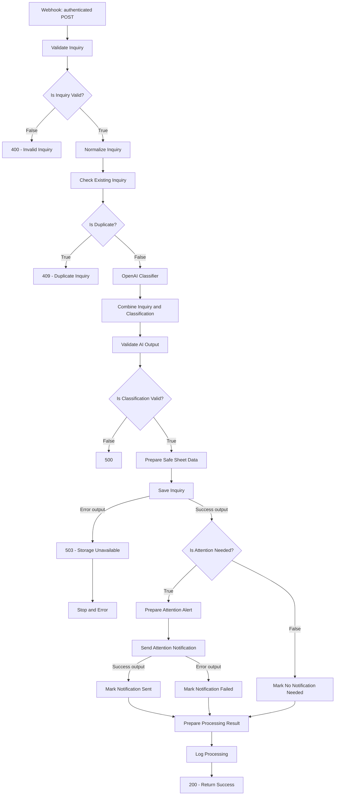
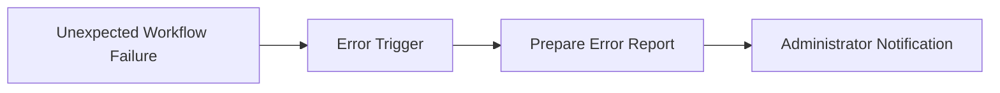

# Architecture

The public template contains 26 nodes and 27 directed connections. One authenticated POST supplies one inquiry. OpenAI assists with classification; n8n applies the explicit validation, persistence, and routing rules.

## Main workflow

The diagram uses the node names from the JSON. Authentication is performed by `Webhook` before it emits an item.

The storage-error connections exist, but the response body in `503 - Storage Unavailable` has a known expression-format issue. The diagram describes configured routing, not proof that this response executes successfully. See [release verification](test-results.md#release-verification-issue).

## Data flow and decisions

| Stage | Behavior in the exported workflow |
| --- | --- |
| Intake | `POST customer-inquiry`, Header Auth enabled, response delegated to response nodes |
| Validation | Six required string fields; format and length checks; invalid input routes to 400 |
| Normalization | Trim all six fields; lowercase email |
| Duplicate lookup | Match the normalized ID against `Inquiry ID` in `Inquiries`; `alwaysOutputData` preserves the no-match path |
| Duplicate decision | Test for an existing `Inquiry ID` field in the lookup result; return the original normalized ID in the 409 response |
| Classification | Send subject and message to `gpt-4o-mini` using a strict six-field JSON Schema |
| Combination | Extract model output and combine it with data from `Normalize Inquiry`, independent of the lookup row shape |
| AI validation | Check required fields, allowed category/priority/sentiment, and Boolean review flag |
| Persistence | Append the inquiry and classification to `Inquiries`; RAW input mode is selected |
| Attention | Send an internal alert if priority is high OR the review flag is true |
| Completion | Carry `sent`, `failed`, or `not_required` to `Workflow Log`, then return 200 |

`Prepare Safe Sheet Data` copies values into `safe_*` fields; it does not escape formulas. `Save Inquiry` maps the original combined values, and RAW is the formula-interpretation control at that write boundary.

## Storage and logging

`Inquiries` stores the original message, classification, timestamps, processing status, human-review flag, and initial review status. The tab is a demonstration work queue, with no built-in reviewer assignment or resolution update.

`Workflow Log` receives completion records, including notification status and notification error text. Its `Error Message` column is present in the schema but has no value mapping in this export. Invalid requests, duplicates, invalid AI results, and storage failures do not pass through this completion logger.

The Gmail failure branch preserves the inquiry row and continues toward logging. A later log failure can still prevent the 200 response. Duplicate checking and append are separate operations and provide no atomic uniqueness guarantee.

## Optional separate error handler

This is a configuration pattern for a **separate workflow**, not another branch or bundled JSON file:

Create or import the handler, configure its own credentials and recipient, then select it in this workflow's settings. The public template removes the original private handler reference. The handler should send a minimal internal report without exposing customer content or credentials.

R12 in the [author-reported regression suite](test-results.md) depends on this separate configuration. No claim is made that a handler is installed merely by importing the public template.
